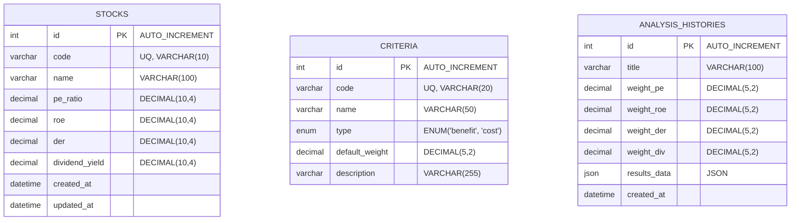

# Database Design

## Sistem Pendukung Keputusan Pemilihan Saham Terbaik Menggunakan Metode TOPSIS (Studi Kasus: Saham Indeks LQ45)

Dokumen ini mendefinisikan skema basis data MySQL, relasi antar tabel, tipe data, serta batasan (*constraints*) yang diterapkan pada aplikasi SPK Saham LQ45.

---

## 1. Entity Relationship Diagram (ERD)

Basis data aplikasi menggunakan skema relasional terstruktur dengan tabel-tabel berikut:



---

## 2. Spesifikasi Tabel (Table Dictionary)

### 2.1 Tabel `stocks`
Menyimpan data alternatif saham indeks LQ45 beserta nilai keempat rasio keuangan utamanya.

| Nama Kolom | Tipe Data | Nullable | Atribut | Keterangan |
| :--- | :--- | :--- | :--- | :--- |
| `id` | INT | NO | PRIMARY KEY, AUTO_INCREMENT | Identifier unik alternatif saham. |
| `code` | VARCHAR(10) | NO | UNIQUE | Kode ticker saham (contoh: 'BBCA', 'ASII'). |
| `name` | VARCHAR(100) | NO | | Nama lengkap perusahaan terbuka. |
| `pe_ratio` | DECIMAL(10,4) | NO | | Price to Earnings Ratio (kriteria PE). |
| `roe` | DECIMAL(10,4) | NO | | Return on Equity dalam persen (kriteria ROE). |
| `der` | DECIMAL(10,4) | NO | | Debt to Equity Ratio (kriteria DER). |
| `dividend_yield`| DECIMAL(10,4) | NO | | Dividend Yield dalam persen. |
| `created_at` | DATETIME | NO | | Stempel waktu pembuatan record. |
| `updated_at` | DATETIME | NO | | Stempel waktu perubahan record terakhir. |

---

### 2.2 Tabel `criteria`
Menyimpan informasi konfigurasi kriteria keputusan yang didukung oleh sistem.

| Nama Kolom | Tipe Data | Nullable | Atribut | Keterangan |
| :--- | :--- | :--- | :--- | :--- |
| `id` | INT | NO | PRIMARY KEY, AUTO_INCREMENT | Identifier unik kriteria. |
| `code` | VARCHAR(20) | NO | UNIQUE | Kode kriteria (contoh: 'C1_PE', 'C2_ROE'). |
| `name` | VARCHAR(50) | NO | | Nama kriteria. |
| `type` | ENUM | NO | ENUM('benefit', 'cost') | Tipe kriteria untuk perhitungan TOPSIS. |
| `default_weight`| DECIMAL(5,2) | NO | | Bobot awal standar (misal: 25.00). |
| `description` | VARCHAR(255) | YES | | Penjelasan kriteria keuangan. |

---

### 2.3 Tabel `analysis_histories`
Menyimpan riwayat kalkulasi analisis TOPSIS yang telah dilakukan oleh pengguna, termasuk snapshot bobot kriteria dan hasil akhir pemeringkatan dalam bentuk JSON.

| Nama Kolom | Tipe Data | Nullable | Atribut | Keterangan |
| :--- | :--- | :--- | :--- | :--- |
| `id` | INT | NO | PRIMARY KEY, AUTO_INCREMENT | Identifier unik riwayat analisis. |
| `title` | VARCHAR(100) | NO | | Judul penanda analisis (default: "Analisis [Timestamp]"). |
| `weight_pe` | DECIMAL(5,2) | NO | | Bobot kriteria PE saat analisis dijalankan. |
| `weight_roe` | DECIMAL(5,2) | NO | | Bobot kriteria ROE saat analisis dijalankan. |
| `weight_der` | DECIMAL(5,2) | NO | | Bobot kriteria DER saat analisis dijalankan. |
| `weight_div` | DECIMAL(5,2) | NO | | Bobot kriteria Dividend Yield saat analisis. |
| `results_data` | JSON | NO | | Menyimpan array hasil pemeringkatan, skor preferensi, dan matriks langkah perhitungan. |
| `created_at` | DATETIME | NO | | Waktu eksekusi analisis. |

---

## 3. Data Awal Standar (Database Seeding)

### 3.1 Pengisian Data Kriteria (`criteria` seed)
```sql
INSERT INTO `criteria` (`code`, `name`, `type`, `default_weight`, `description`) VALUES
('C1_PE', 'PE Ratio', 'cost', 25.00, 'Price to Earnings Ratio - Mengukur kemurahan harga saham.'),
('C2_ROE', 'Return on Equity', 'benefit', 25.00, 'Return on Equity - Mengukur kemampuan menghasilkan laba bersih dari ekuitas.'),
('C3_DER', 'Debt to Equity Ratio', 'cost', 25.00, 'Debt to Equity Ratio - Mengukur rasio utang terhadap ekuitas perusahaan.'),
('C4_DIV', 'Dividend Yield', 'benefit', 25.00, 'Dividend Yield - Mengukur persentase dividen terhadap harga saham.');
```

### 3.2 Contoh Data Saham Awal (`stocks` seed)
```sql
INSERT INTO `stocks` (`code`, `name`, `pe_ratio`, `roe`, `der`, `dividend_yield`, `created_at`, `updated_at`) VALUES
('BBCA', 'Bank Central Asia Tbk.', 24.5000, 19.2000, 0.1500, 2.1000, NOW(), NOW()),
('BBRI', 'Bank Rakyat Indonesia Tbk.', 15.2000, 18.5000, 0.8500, 4.3000, NOW(), NOW()),
('TLKM', 'Telkom Indonesia Tbk.', 18.1000, 16.8000, 0.7000, 4.8000, NOW(), NOW()),
('ASII', 'Astra International Tbk.', 8.9000, 14.5000, 0.9000, 6.2000, NOW(), NOW()),
('UNVR', 'Unilever Indonesia Tbk.', 30.1000, 85.0000, 2.1000, 5.5000, NOW(), NOW());
```
